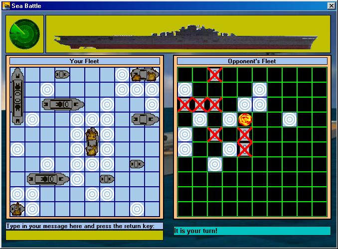



## Battleship Game \(multiplayer\)

### Description

This is an old game of Battleship that I loved to play as a kid. This version supports single and muli play over network or internet (winsock). It also includes a messanger. Have fun and please vote.

Please fill free to post comments and and more importantly report bugs. I know that there is a bug when you select Network Client and don't have an IP. If you know how to fix it please let me know. Another thing is that you can not test multiplay without compiling it does not work for some reason, but when you compile you can run 2 games simultaniously and play with yourself if you want.

If you can provide better animation for a miss or a better graphic for hit ship please send them to me. If any of the graphics I used are copyrighted let me know and I will take them off. Thank you.
 
### More Info
 

             |
---                |---
**Submitted On**   |2001-07-07 15:03:22
**By**             |[Ruble](https://github.com/Planet-Source-Code/PSCIndex/blob/master/ByAuthor/ruble.md)
**Level**          |Advanced
**User Rating**    |4.7 (33 globes from 7 users)
**Compatibility**  |VB 6\.0
**Category**       |[Games](https://github.com/Planet-Source-Code/PSCIndex/blob/master/ByCategory/games__1-38.md)
**World**          |[Visual Basic](https://github.com/Planet-Source-Code/PSCIndex/blob/master/ByWorld/visual-basic.md)
**Archive File**   |[Battleship22450792001\.zip](https://github.com/Planet-Source-Code/ruble-battleship-game-multiplayer__1-24844/archive/master.zip)

